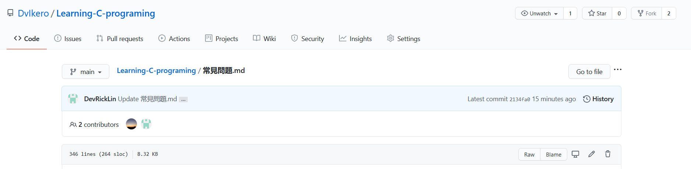
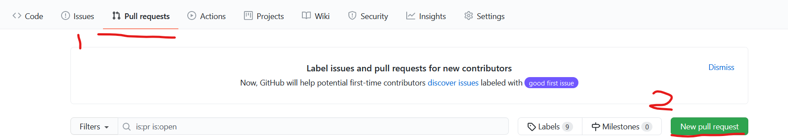
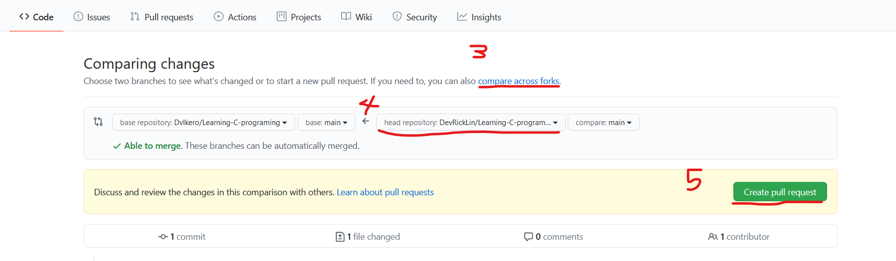
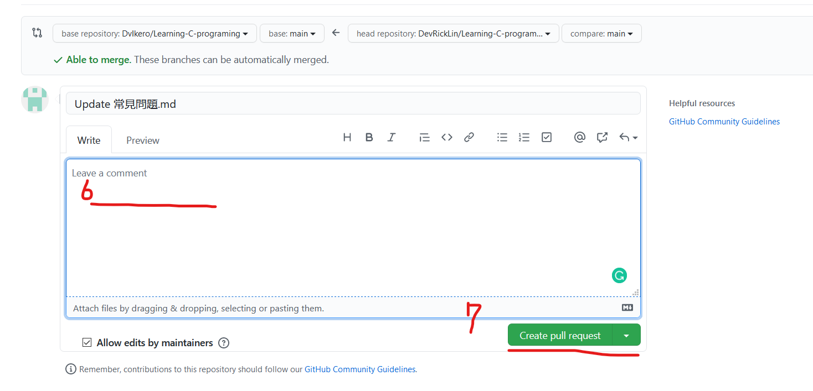

# 常见问题

### 关于在CSUOJ上运行的问题:

1. #### 多样例测试

   1. 循环

      在CSUOJ上大部分的题目都会进行多样例测试，这指的是你的输入和输出行为要循环不只一次，解决方案如下:

      ```c
      #include <stdio.h>
      int main(void)
      {
          //你需要设置在循环外的变量
          while(scanf(/*你的输入格式及变量*/)!=EOF)
          {
              //你的主程序
          }
          return 0;
      }
      ```

      > scanf()函式会在每次执行时回传它成功把多少对应的值给了变量，并在接受到EOF(文件结尾)时回传-1，因此检查scanf()!=-1的效果是一样的，更详细正确的内容可以参考如下:
      >
      > https://www.runoob.com/cprogramming/c-function-scanf.html

   2. 换行

      在CSUOJ 上，通常要求每个样例输出只占一行，若是不换行就会过不了，记得修改为循环的格式后，每次样例输出也要换个行。
      
      **如果不同条件下写了不同的输出语句的话(例如有两个在不同条件下执行的scanf()，记得也都要换行。**

### C语法格式问题

1. #### switch 

   在使用switch函数时常见以下问题:

   1. ##### 省略case和其后常量之间的空格:

      ```c
      switch(n)
      {
      	case0:
              break;
          case1:
              break;
          dafault:
      }
      ```

      这样写的话，switch会直接执行default，记得一定要有空格:

      ```c
      switch(n)
      {
      	case 0:
              break;
          case 1:
              break;
          default:
      }
      ```

   2. ##### 忘记break:

      这也是switch比较容易被忘记的特性，不在case执行完后break的话，程序会接著执行之后case的内容(不管你写的判断条件为何)，以下举例:

      ```c
      int n = 0;
      switch(n)
      {
          case 0:
             	n = 1;
          case 2:
              n = 2;
      }
      printf("%d",n);
      ```

      这个例子最后输出的是2。

2. #### while循环

   1. 省略大括号

      省略大括号一时爽，之后你就不会爽了，省略大括号会让你的while只循环其后;前的那一部分代码，大部分时候这都不是你想要的行为，以下满天星的代码为例:

      ```c
      while(true)/*只会循环这个部分*/;
      	printf("*");//不会在循环内执行
      ```

      修改如下就会正确运行了:

      ```c
      while(true)
      {
      	printf("*");
      }
      ```

3. #### main内的return

   1. 放错位置

      请参考以下案例:

      ```c
      int main(void)
      {
      	return 0;
          printf("test");
      }
      ```

      在这种情况下，"test"是不会被输出的，主函数(就是main那个东东)会在你return之后立刻结束执行，通常这种错误会犯在同学把程序修改成用while(scanf()!=EOF)的格式后，不小心把return包进了while循环裡。

4. #### scanf 函数

   1. 忘记在参数变量前加&

      你不该犯这个错误。(字符串例外，不需要加)

      ```c
      scanf("%d",n);//棒棒糖
      ```

   2. 忘记逗号

      ```c
      scanf("%d"n);//棒棒糖?
      ```

5. #### printf 函数

   1. 加了&

      ```c
      printf("%d",&n);
      ```

   2. 拼写错误

      ```c
      print("%d",n);
      ```


### C程序设计问题

1. #### 变量放错位置/需要在每次循环重置的变量没有重置

   这个问题通常发生在同学们将程序修改成while(scanf()!=EOF)的格式之后，提交太多次的话在排名上难免看起来不好看，记得上传之前都先在本地端多测试几组样例，看看是否有正确的重置。

   以下为例:

   ```c
   #include <stdio.h>
   //输出n!
   int main(void)
   {
       int n;
     	int sum = 1;
       scanf("%d",&n);
       for(int i=1;i=<n;i++)
       {
           sum*=i;
       }
       printf("%d",sum);
       return 0;
   }
   ```

   通常修改后会犯的错误:

   ```c
   #include <stdio.h>
   //输出n!
   int main(void)
   {
       int n;
     	int sum = 1;
       while(scanf("%d",&n)!=EOF)
       {
           for(int i=1;i=<n;i++)
           {
               sum*=i;
           }
      		printf("%d",sum);
       }
       return 0;
   }
   ```

   通常这种时候，同学就会到群裡面问:

   > 为什麽第一次跑的时候是对的，之后都错了?

   我们观察一下这个程序的行为，会发现，在第一个while循环时，sum的确是我们想要的1，但当他进入下一次循环，sum已经是上一次的n!了，结果自然不会对。

   修改如下即可:

   ```c
   #include <stdio.h>
   //输出n!
   int main(void)
   {
       int n;
       while(scanf("%d",&n)!=EOF)
       {
        	int sum = 1;
           for(int i=1;i=<n;i++)
           {
               sum*=i;
           }
      		printf("%d",sum);
       }
       return 0;
   }
   ```

2. #### 下标溢位/指针指向了没有赋值的地址

   **假如你的输出是-178650等等预期上不可能出现的值，或是乱码的话，看这裡**

   这种问题容易发生在循环遍历数组的时候，记得: 

   > 一个长度为2的数组，最后一位是1(因为是从0开始算的)。

   那麽，如果下标超出了最大值会发生甚麽事呢?

   操作数组下标等于是进行指针操作，输入下标n等于是从数组的第一个地址往后位移n位，以下为例:

   ```c
   int a[2] = {0,1};
   printf("%d\n",a[1]);
   printf("%d",*(a+1));
   ```

   输出会是:

   ```
   1
   1
   ```

   因此，当下标超过最后一位的时候，他就会指向更后面的一个地址，而那个地址保存了甚麽是未知的，如果对这个地址进行赋值的话，也会修改掉一个未知地址内的值(所以会发生甚麽很难预期)。
   因此，如果在循环中对数组进行遍历的话，多注意循环会循环几次，还有对数组使用的局部变量究竟是1,2,3,...,n还是0,1,2,...,n-1。

3. #### 接收到空格

   **gets函数会在接收到换行符之后立刻跳出，因此也要注意这个问题。**

   c=getchar()函数和scanf("%c",&c)的行为类似，会接收换行符这个字符并传递到c里。这通常会导致一些不如预期的行为，以下程序为例:

   ```c
   //超级计算机
   #include<stdio.h>
   int main()
   {
   	int M1,M2,R1,R2,R3;
       char c;
       while(scanf("%d %d",&M1,&M2)!=EOF)
       {
       	R1=0,R2=0,R3=0;
   		int f;
   		do
   		{
   	    	f = scanf("%c",&c);
   	    	switch(c)
   			{
   				case 65:R1=M1;break;
   				case 66:R2=M2;break;
   				case 67:M1=R3;break;
   				case 68:M2=R3;break;
   				case 69:R3=R1+R2;break;
   				case 70:R3=R1-R2;break;
   			}
   		}while(f!=-1&&c!='\n');
   		printf("%d,%d\n",M1,M2);
   	}
   	return 0;
   }
   ```

   我做一个输入:

   ```
   100 288
   ABECED
   ```

   预期的输出会是:

   ```
   388 388
   ```

   实际上的输出是:

   ```
   100 288
   ```

   (而且没有等待你输入指令)
   
    这其实就是底下的scanf("%c",&c)将'\n'给了c之后，在do循环的判断中使得c!='\n'的判断为假，便直接跳出循环执行了printf()。
   
     一个常见的办法便是在进入迴圈之前，先把上一个输入的换行符利用一个getchar()或是scanf("%c")接收掉，再进入do循环。
   
   
   
     底下是修改好的例子:
   
   ```c
   //超级计算机
     #include<stdio.h>
     int main()
     {
     	int M1,M2,R1,R2,R3;
         char c;
         while(scanf("%d %d",&M1,&M2)!=EOF)
         {
             scanf("%c");//接收掉换行
         	R1=0,R2=0,R3=0;
     		int f;
     		do
     		{
     	    	f = scanf("%c",&c);
     	    	switch(c)
     			{
     				case 65:R1=M1;break;
     				case 66:R2=M2;break;
     				case 67:M1=R3;break;
     				case 68:M2=R3;break;
     				case 69:R3=R1+R2;break;
     				case 70:R3=R1-R2;break;
     			}
     		}while(f!=-1&&c!='\n');
     		printf("%d,%d\n",M1,M2);
     	}
     	return 0;
     }
   ```
   
   


### 如何共同編輯

1. #### 直接和我聯繫:

   由於底下的操作對於沒有接觸過git或Github的人可能比較複雜，各位可以直接將自己編寫好的內容用任何形式發給我，再由我進行彙整，本人的郵箱:

   >  8208200137@csu.edu.cn

   或是可以直接在QQ群裡發布文件，註明要提交到這裡就行了:

2. #### 使用Github的Fork功能:

   由於本人力有未逮，底下的教學可能並不是非常有幫助，建議初學者可以多參考這邊給出的幾個教學連結了解如何操作Github和git，還有如何使用Markdown:

   **git和Github的操作:**

   [知乎](https://www.zhihu.com/topic/19566035/index#module-2749)

   [github漫遊指南](https://github.phodal.com/)

   **Markdown相關:**

   [Markdown 基本語法](https://github.com/younghz/Markdown)

   [Typora編輯器](https://typora.io/)

   

   **以下教學正文:**

   首先，你需要創建一個Github帳號，只要到[Github首頁](https://github.com/)就可以註冊。註冊完畢後，回到此文件的頁面，點擊右上角的Fork:

   

   這會在你的頁面創建一個和我這個一模一樣的文件，你便可以點擊**鉛筆圖樣**對此文件進行編輯，如果熟悉如何操作git的話，也可以先把這個文件clone到本地端去再用自己的編輯器打開。或者，直接打開自己的編輯器複製貼上，編輯完再回去github上的編輯頁面進行貼上也可以。

   編輯完成後，回到此文件的頁面，點擊Pull request，再點擊new pull request:

   

   之後點擊compare across forks、在底下選擇自己的版本，然後點選create pull request。

   

   

   之後再點擊create pull request一次就成功將你的版本交出了。點擊前建議把具體修改了哪些部分留在底下的評論欄裡，但不輸入一樣可以提交。

   